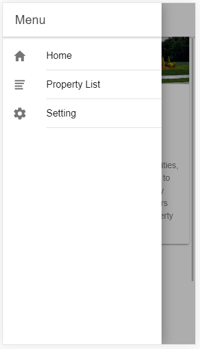
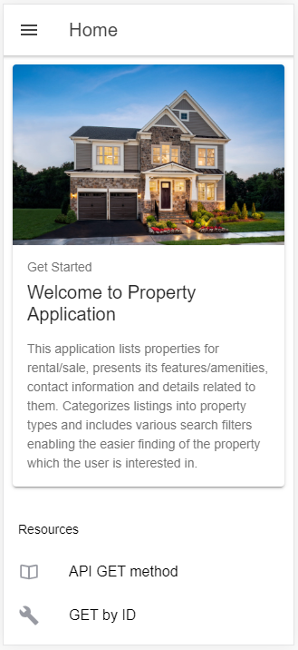
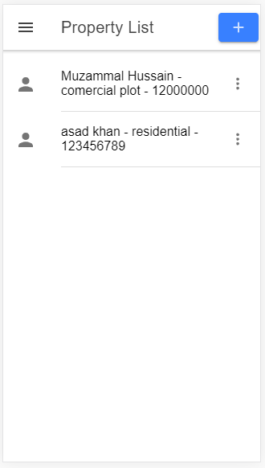
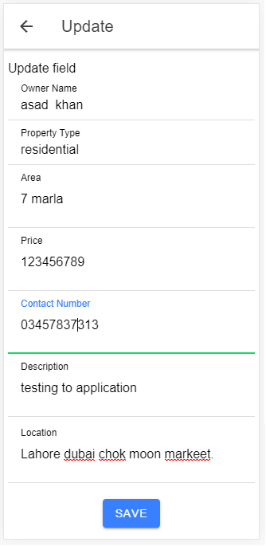
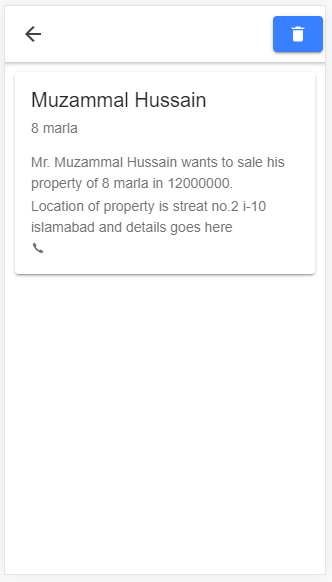
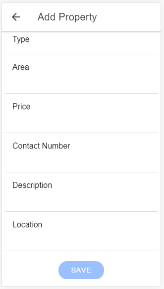
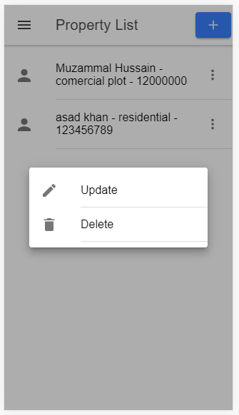

# A property deade application with have following.
<h3>Frontend Work</h3>
Tools and technologies  
•	Hybrid Application, where Ionic framework and angular used for front-end. 
•	mySQL database and Spring Boot will be used for backed work. 
•	remoteMySQL used while project is deployed to heroku server. 

Features in our Application.
1.	User House  
•	There are 3 users of system, admin, donner (food OR fund) and charity house.
•	Charity House will be able to create new account. 
•	Sign in and forgot password options will also be provided. 

2.	Charity house Dashboard  
•	Charity house will be able to view list of donners with details.  
•	After viewing the different donners, charoty house will be able to contact with the donner via a chat.

3.	Admin Dashboard  
•	Admin will able to manage (CRUD) the records of users.  
•	Admin will able to view reports of food.  
•	Users will able to contact with admin for help.

4.	donner Dashboard  
•	donner will able Add new suplus food if available.  
•	Syatem wil send notification to charity house. 
•	donner will able to view feed backs an review from charity house  
•	donner can manage his profile.

<h3>For backend work please follow the link <a href = "https://github.com/MuzammalHussain6313/Food-Distribution-App">https://github.com/MuzammalHussain6313/Food-Distribution-App</a></h3>

<h4>Screen shorts.</h4>

Menu.
 

Home.
 

List of Property.
 

Update Item
 

details
 

Add new Item
 

Delete popover.
 

